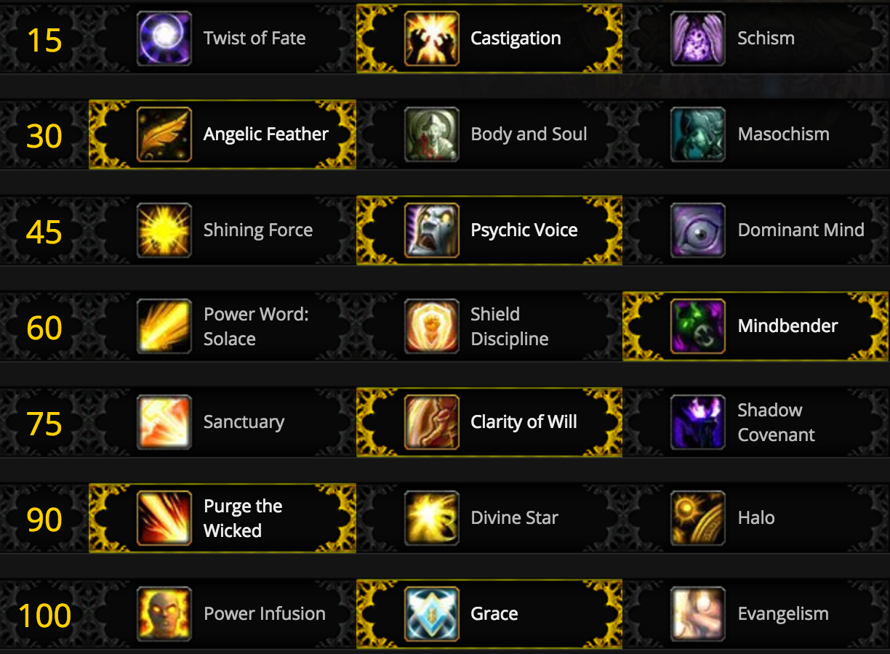

# Discipline Priest PvP Guide - 7.2.5

## Introduction

TODO: Not complain about Holy being more meta right now. Nerf Warriors pls.

## Gearing

As of the release of Legion, PvP the stats on your equipment no longer matter in instanced PvP. Instead, whenever a player enters an arena, battleground, or rated battleground, a stat template is applied to the character. This stat template is inflexible and pre-determined, i.e. there's no way to influence your template to have more Haste. 

Using my highest equipped item level, here are the stats I have in the wild versus the stats I have *through the template* in instanced PvP:


## Talents - 3v3

### Standard talents
TL;DR: This is the default talent loadout. 


### PvP Standard talents
TL;DR: This is the default talent loadout.


#### Row 1


**Usually take -** *Gladiator's Medallion*. This is the trickiest row in all of the talents because the otimal choice depends upon both which race your Priest plays and also what team you're about to be playing against. Typically the best choice is to stay with the on-demand "trinket," allowing you to choose which enemy setups you need to escape for either saving a teammate or setting up a kill by landing a pivotal fear or throwing out some extra damage.

**Sometimes take -** *Relentless*. This can be a great choice against teams with minimal CC or several back-to-back blanket Silences. I find myself taking this talent much more often on my Human Priest (since the Human racial allows for a stun escape on a two minute cooldown) than I do on either of my Horde priests.

**Sometimes take -** *Adaption*. This talent works best against teams with infrequent CC, or if your teammates are capable of breaking you out of some enemy crowd control (say a Retribution or Protection Paladin).

#### Row 2


**Usually take -** *Vim and Vigor*. Due to Disciplne's tankiness through *Focused Will* and reliance on instant cast spells, Priests are not usually a kill target. Due to this you'll spend most games sitting at high health for the entire duration of the match, allowing for a passive +20% healing. 

**Maybe take -** *Defender of the Weak* or *Inner Renewal*. *Defender of the Weak* is a solid option against teams with a propensity for fast target switching. The haste bonus will allow you to quickly Shadow Mend a teammate back into safe levels of health after they drop very low. In arenas, Discipline's primary weakness is their propensity to burn through mana very quickly, especially if you are actively Purging the enemy team (say, against Resto Druids). *Inner Renewal* has the potenetial to give huge mana savings over the course of a match if you know the enemy team will be focusing you. At low ratings, a lot of double melee teams or triple DPS teams will simply try to burst down a healer - here *Inner Renewal* can really shine. At higher ratings though, you won't often get the most use out of this talent compared to the other two.

#### Row 3


**Usually take -** *Purification*. This is a standard "double dispel" talent and is great against any team with area of effect dispellable magic (a Mage's Frost Nova) or any team with spammable crowd control (Polymorph, Warlock Fear). A large portion of a healer's responsibilty in arena is limiting enemy crowd control against your team and mitigating their damage - being able to dispel more frequently is key.

**Maybe take -** *Purified Resolve*. Against teams with infrequent dispellable debuffs, this talent can be preferable to *Purification*. An example would be playing aginst Unholy Death Knights - there's typically rarely a need to defensively dispel, but doing so would somewhat limit incoming damage and apply a shield to help mitigate the single target onslaught.

**Rarely take-** *Spiritual Cleansing*. This talent has a niche depending on what classes you're playing with and what team you're facing. If you're not sure whether this is worth taking, stick with *Purification*. 

#### Row 4


**Almost always take -** *Premonition*. This talent is the stand in for the old utility of *Shadow Word: Death* - that is, it applies a small amount of damage to the Priest on a delay, allowing them to break incoming crowd control. You'll always want to take this against classes that contain breakable crowd control, namely a Mage's Polymorph, Hunter traps and Wyvern Sting, Shaman Hex, Monk and Feral Druid Incapicitates, et cetera. There's almost always at least one use for this in a match.

**Sometimes take -** *Searing Light*. If there's nothing for you to break out of with *Premonition*, then *Searing Light* can be a good alternative. This talent allows you to play a bit more aggressively with offensive Smites and Penances to help apply more pressure. 

**Rarely take -** *Trinity*. This is an exceptionally clunky talent and isn't particularly useful, as most of your healing in most arena matches will not come from Atonement but rather direct Penances, Power Word: Radiance, Shadow Mend, and shields.

#### Row 5


**Almost always take -** *Ultimate Radiance*. This talent makes Power Word: Radiance instant cast and directly heal for a lot more than in PvE situations. It has a double effect of quickly applying a large amount of healing to the whole team (assuming they're relatively close to each other) _and_ applying Atonement to the entire team. And as of patch 7.2.5, Discipline Priests now have two charges of the spell, allowing for some serious instant cast burst healing to the entire group. This can be huge for recovering from split pressure against rot teams, or simply keeping one person alive while dodging interrupts and counter spells.

**Sometimes take -** *Strength of Soul*. With patch 7.2.5, *Strength of Soul* was buffed to heal significantly more than it had previously. Further, now that most players have unlocked their new artifact traits, our Power Word: Shields contribute a lot more healing than they used to. Add to this how strong many physical melee classes are, such as Arms Warriors, and this talent can be really strong in the right situations. It's important to remember, however, that a lot of melee have magical components to their attacks - a lot of a Death Knight's damage is Shadow or Frost damage, for example, and Strength of Shield would not offer any help mitigating that damage. 

**Never take -** *Dome of Light*. The competition on this tier is just too good to justify this talent. Add on top of that how easy it is to pull people out of your Power Word: Barrier, and this talent just falls a bit short.

#### Row 6


**Almost always take -** *Archangel*. This talent is the *Velen's Future Sight* of PvP. It's single handedly one of the strongest healing buffs any healer has in PvP, and only on a one minute cooldown. It's recommended that you grind to honor level 28 as soon as possible to unlock this talent.

**Rarely take -** *Dark Archangel*. This is a fun talent to help your team instagib an enemy, but if you aren't able to secure a kill reliably in the opener, you will quickly fall behind by not having *Archangel.* This is mostly fun at low ratings with mongo comps, but should not be considered in the vast majority of real arena matches.

**Never take -** *Power Word: Fortitude*. As of patch 7.2.5, this effect is no longer Purgable, which moves it from being a waste of a GCD into just simply a weak option. An extra 20% health for your team won't help reverse falling into a bad CC chain, nor will it help you recover from an enemy stumbling their way into critting one of your teammates several times during a burst. There's no reason to take this talent over *Archangel*.


## Common compositions - 3v3

Discipline Priest's main weakness in arena is the clock: simply put, we run out of mana faster than every other healer. Because of this, Priest works best in control comps - that is, comps where your team can lock down enemy players repeatedly to help ensure a quick game. The longer a game goes on, the faster a Priest will OOM and the tougher it will be to secure a victory.

Let's take a look at some of the common strong compositions Discipline Priests are running in Legion Season 4:


### RMP - Rogue / Mage / Priest

This classic composition has been strong since as far back as *The Burning Crusade.* The idea here is to overwhelm the enemy team with as much cross-CC as possible to force defensive cooldowns very early on. In this composition, you will find yourself playing much more aggressively to try to secure a very early kill.

### Thug Cleave - Sub Rogue / Hunter / Priest

With the recent buffs to Sub Rogue output and the insane amount of cross-CC available between Rogue stun, Hunter traps, your fears and Mind Controls, this composition can be incredibly effective when played well. Make sure you keep your eyes open for when you can follow up a CC chain (typically Fearing after a Hunter trap, or using Mind Control to steer an enemy into a dodged trap) and throw out some damage to help end games quickly.

### Cupid - Ret Paladin / Hunter / Priest

Similar to running Thug Cleave, Cupid works by setting up long chains of crowd control on an enemy healer while having a good amount of defensive utility. While Retribution Paladins are less strong in Legion Season 4 than they were previously, they still can put out some pretty scary damage while helping you avoid enemy CC with Blessing of Sanctuary.

## Common opponents - 3v3

### WMX - Arms Warrior / Mage / Healer

With the class balance changes implemented at the start of Legion Season 4, Warrior teams have seen a huge resurgence on the ladder. Typically against this team, the warrior will train one target on your team providing a steady stream of damage until the mage can land a few good Polymorphs and follow up with enough burst damage to land a kill. Focus on preventing setups by the mage by having your team interrupt Polymorphs, using the *Premonition* (the old "Shadow Word: Death"/Inquistion) talent to break out of as many Polymorphs as possible yourself, and lining all other casts behind pillars as much as possible. 

### WLS - Arms Warrior / Affliction Warlock / Restoration Shaman

While slightly less popular this season than WMX, this composition is still quite strong. Typically the Arms will train one of your teammates while the Warlock builds up resources using instant cast DoTs on your team. Once the Warrior has rotted a target low enough, CC will land on you and the enemy team will try to blow a target up with a combination of several Unstable Afflictions and the Warrior's Sharpen Blade (-50% healing taken) talent. Stay on top of dispelling your team and using line of sight to prevent being Feared as much as possible.

### TSG - Arms Warrior / Unholy Death Knight / Healer

There are many variations on this composition now after the recent buffs to several melee classes (Arms and Havoc come to mind immediately), but the way you play against it is largely the same. This team tries to just overwhelm with insane damage and healing reductions to simply power through a target. Use your defensive cooldowns early (Barrier, Pain Suppression, Archangel) to keep your friendly target alive without too much overlap and try to help minimize incoming damage by CC'ing during their burst. 

### Walking Dead - Windwalker Monk / Unholy Death Knight / Healer

Playing against this composition is all about knowing when the enemy team is going for a kill. While their default damage can be quite high, you need to save your Pain Suppression for when a teammate gets hit with Touch of Death. Keep in mind because both of these classes are fairly front-loaded, they can swap targets pretty easily. Be mindful of your positioning and be ready to Life Grip back a friendly after they get Death Gripped into a bad situation. 

## Cooldown Usage

Many of Discipline's cooldowns have a damage reduction component to them, so it's important to anticipate when damage is about to come out and prepare accordingly. 

*Pain Suppression* - Reduces damage taken by 40% for 8 seconds, and with the new artifact traits, heals back a small portion of that damage taken. It's best to use this ability as heavy damage is starting to come out on a friendly, as it mitigates a huge amount of damage and heals a portion back. Be wary of popping it too early though and forcing a target swap. Keep in mind this is usable while stunned! 

*Power Word: Barrier* - Reduces damage taken by 25% for friendlies within it for 10 seconds. This is a really strong cooldown against melee cleaves where your friendly target has two people beating him up and he's stunned or snared in place. Remember that the artifact trait *Barrier for the Devoted* increases healing done by Atonement by 100% for targets within the Barrier, and keep an eye out for opportunities where you can relieve some of the pressure on your team by damaging enemies while healing allies. Also note that you can place Barrier over a friendly target trapped in an enemy Rogue's Smoke Bomb ability and they still recieve the damage reduction.

*Rapture* - Allows you to spam *Power Word: Shield* for a while. This ability is great to use when you're worried about getting spell locked out of a cast, as it's all instants. It's also useful for quickly covering your whole team with both Shields and Atonements. With the honor talent *Strength of Soul*, this ability is amazing at mitigating incoming physical damage while providing decent healing and absorbs to the focused target. 

*Mindbender* - A powerful 1 minute cooldown which does strong damage to an enemy but also heals through Atonement _and_ returns mana. While this is a great spell to use when going for a kill or just applying some counter-pressure and restoring mana, but it's also a way to keep heals flowing to your team while you're sitting in crowd control. If you anticipate an incoming CC chain and are able to Atone your team (say with instant cast Radiance or a combination of Plea and Shield) with Mindbender out, you can totally negate an enemy setup.

*Leap of Faith* - AKA "Life Grip." If your teammate is taking insane damage and you're in no immediate position to top them off (say, you're vulnerable to CC with no trinket up, or the enemy's Silence has just come off cooldown), you can often Life Grip them back to your pillar and have them hide with you for a few seconds while you top them off. This spell can also be used aggressively, such as standing at the other end of a Warlock teleport and pulling your melee towards the fleeing enemy. It's a difficult spell to use effectively but is strongly rewarded by proper positioning and overall arena awareness.

*Archangel (PvP Talent)* - Increases all healing and absorbs by 30% for 15 seconds on a 1 minute cooldown. As mentioned before, this cooldown is insanely powerful and should be used often. 

One big component to succeeding in arena is knowing when to use cooldowns and to also minimize how often you overlap them. For example - if your mage is getting bursted down and you cast *Pain Suppression* on him and he immediately uses his own *Ice Block*, you're now down two defensive cooldowns for the price of one. Having strong communication with your team can help mitigate overlapping damage reductions.


## Macros & Keybinds

TODO: Write about this stuff, maybe remove the PvE macros, at least clean it up a bit and write a comment for each one.

Dispel Magic:

```
#showtooltip
/stopcasting
/stopcasting
/cast [help] Purify; [harm] Dispel Magic
/cast [@player] Purify
```

Mind Control arena1, arena2, arena3:

```
VER 3 000000000000004F "mc1" "INV_MISC_QUESTIONMARK"
#showtooltip
/cast [@arena1] Mind Control
END
VER 3 0000000000000050 "mc2" "INV_MISC_QUESTIONMARK"
#showtooltip
/cast [@arena2] Mind Control
END
VER 3 0000000000000051 "mc3" "INV_MISC_QUESTIONMARK"
#showtooltip
/cast [@arena3] Mind Control
END
```

```
VER 3 0100000000000012 "arch" "INV_MISC_QUESTIONMARK"
#showtooltip 
/cast [pvptalent:6/1] Power Word: Fortitude; [pvptalent:6/2] Archangel; [pvptalent:6/3] Dark Archangel
/use Velen's Future Sight
END
VER 3 010000000000000D "fedder" "INV_MISC_QUESTIONMARK"
#showtooltip
/cast [@player] Angelic Feather
/stopspelltarget
END
VER 3 010000000000000A "levitate" "INV_MISC_QUESTIONMARK"
#showtoolip
/cast [@mouseover,exists,help][] Levitate
END
VER 3 0100000000000009 "lifegrip" "INV_MISC_QUESTIONMARK"
#showtooltip
/cast [@mouseover,exists,help][] Leap of Faith
END
VER 3 0100000000000010 "lot" "INV_MISC_QUESTIONMARK"
#showtooltip
/cast [@mouseover,exists,help][] Light of T'uure
END
VER 3 0100000000000007 "lvl100" "INV_MISC_QUESTIONMARK"
#showtooltip
/cast [talent:7/3,@mouseover,exists,help][talent:7/3] Circle of Healing; [talent:7/1] Apotheosis
END
VER 3 0100000000000006 "lvl90" "INV_MISC_QUESTIONMARK"
#showtooltip
/cast [talent:6/2] Divine Star; [talent:6/3] Halo; [spec:1,talent:6/1,@mouseover,exists,help][spec:1,talent:6/1] Clarity of Will
END
VER 3 0100000000000002 "mend" "INV_MISC_QUESTIONMARK"
#showtooltip
/cast [spec:1,@mouseover,exists,help][spec:1] Shadow Mend; [spec:2,@mouseover,exists,help][spec:2] Flash Heal; [spec:3,@mouseover,exists,help][spec:3]Shadow Mend
END
VER 3 010000000000000C "pi" "INV_MISC_QUESTIONMARK"
#showtooltip 
/cast [spec:1,talent:7/1] Power Infusion; [spec:1,talent:7/3] Evangelism
END
VER 3 0100000000000001 "plea" "INV_MISC_QUESTIONMARK"
#showtooltip
/cast [spec:1,@mouseover,exists,help][spec:1] Plea; [spec:2,@mouseover,exists,help][spec:2] Renew
END
VER 3 010000000000000E "pom" "INV_MISC_QUESTIONMARK"
#showtooltip
/cast [spec:1,@mouseover,exists,help][spec:1] Penance; [spec:2,@mouseover,exists,help][spec:2] Prayer of Mending
END
VER 3 0100000000000013 "prem" "INV_MISC_QUESTIONMARK"
#showtooltip Premonition
/stopcasting
/stopcasting
/cast Premonition
END
VER 3 0100000000000004 "ps" "INV_MISC_QUESTIONMARK"
#showtooltip
/cast [spec:1,@mouseover,exists,help][spec:1] Pain Suppression; [spec:2,@mouseover,exists,help][spec:2] Guardian Spirit
/cast [spec:1,@mouseover,exists,help][spec:1] Power Word: Shield
END
VER 3 0100000000000008 "purify" "INV_MISC_QUESTIONMARK"
#showtooltip
/cast [@mouseover,exists,help][] Purify
END
VER 3 0100000000000003 "pwr" "INV_MISC_QUESTIONMARK"
#showtooltip
/cast [spec:1,@mouseover,exists,help][spec:1] Power Word: Radiance; [spec:2,@mouseover,exists,help][spec:2] Prayer of Healing
END
VER 3 0100000000000005 "pws" "INV_MISC_QUESTIONMARK"
#showtooltip
/cast [spec:1,@mouseover,exists,help][spec:1] Power Word: Shield; [spec:2,@mouseover,exists,help][spec:2] Heal; [spec:3,@mouseover,exists,help][spec:3] Power Word: Shield
END
VER 3 0100000000000014 "scov" "INV_MISC_QUESTIONMARK"
#showtooltip
/cast [@mouseover,exists,help][] Shadow Covenant
END
VER 3 0100000000000011 "serenity" "INV_MISC_QUESTIONMARK"
#showtooltip
/cast [@mouseover,exists,help][] Holy Word: Serenity
END
```

## Addons

These days, most of the useful information you'll need to be successful in arena is baked into the default UI. However, there are still a few addons I would recommend for making sure you have all the necessary information quickly available in your interface.

[Gladius](https://mods.curse.com/addons/wow/gladius) - The standard arena unit frame addon. It shows remaining diminishing return timers on your enemies, as well as which Tier 1 PvP talent they have selected, curring spells being cast, and a cooldown tracker. I recommend having this some place prominent in your arena UI, and it's definitely worth spending time tweaking it and practicing reading it at a glance.

[OmniBar](https://mods.curse.com/addons/wow/omnibar) - OmniBar tracks enemy cooldowns and is highly customizable. It's very helpful for knowing when you need to fake cast against an interrupt or knowing when the enemy team's CC chain may start up again.

[GladiatorlosSA](https://mods.curse.com/addons/wow/gladiatorlossa) - A customizable addon that provides voice overs to alert when enemy spells are being cast. This addon can be very annoying at first, but I have it set up purely for spells that I know I can break out of using Premonition such as Polymorph and Hex.

[Details!](https://mods.curse.com/addons/wow/details) - A very informative DPS meter. I use it to track interrupts and incoming CC / CC breaks when discussing how to improve after a match with my team.
