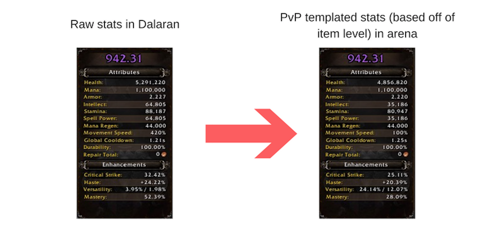
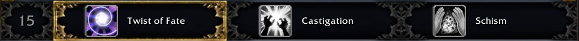
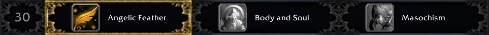
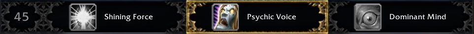
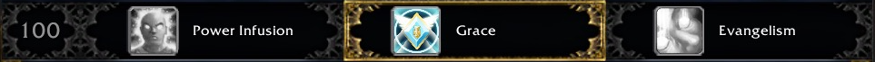

# Discipline Priest PvP Guide - 7.3 / Legion Season 5

## Table of Contents

1. [Introduction](#introduction)
2. [Glossary](#glossary)
2. [Gearing & Artifact](#gearing)
3. [Talents - 3v3](#talents)
   1. [Standard Talents](#standard-talents)
   2. [Honor Talents](#honor-talents)
4. [Common Compositions - 3v3](#comps)
5. [Common Opponents - 3v3](#opponents)
6. [Cooldowns](#cooldowns)
7. [Macros & Keybinds](#macros)
8. [Addons](#addons)
9. [Tips & Tricks](#tips)
10. [Twitch Streams](#streams)
11. [Closing Note](#closing)
   

## Introduction <a name="introduction"></a>

Discipline Priests are unique healers that heal through a combination of damaging enemies and directly casting on allies. As of Legion PvP Season 5, Discipline remains one of the [strongest healing specs for 3v3 arena](http://www.arenamate.net/?region=&realm=&rating=2000&ladder=3v3&faction=) with quite a bit of utility.

This guide aims to provide some high level information on optimal talent builds, cooldown usage and strong team compositions for 3v3 arena in Legion Season 5.

## Glossary <a name="glossary"></a>

## Gearing & Artifact <a name="gearing"></a>

As of the release of Legion, PvP the stats on your equipment no longer matter in instanced PvP. Instead, whenever a player enters an arena, battleground, or rated battleground, a stat template is applied to the character. This stat template is inflexible and predetermined, i.e. there's no way to influence your template to have more Haste. 

Using my highest equipped item level, here are the stats I have in the wild versus the stats I have *through the template* in instanced PvP:



Of special notice is legendary items: while you do not benefit from their PvE ability bonus effects (such as the shield on Prydaz), you _do_ benefit from their 970 ilevel raising your overall equipped item level. Therefore, it's important to equip legendaries in your weakest slots to raise your item level as much as possible independent of their PvE effects when entering instanced PvP. 

Further, while the specific traits on artifact relics aren't active in PvP, the item level bonus and overall traits unlocked _are_ active. Specifically, *Concordance of the Legionfall* - the 52 point paragon trait and any subsequent points - are active in arena. The amount of bonus stats per point have been reduced in instanced PvP, but the buff itself still activates and is proportionally strong to the amount of bonus traits unlocked. ([Source](https://twitter.com/WarcraftDevs/status/847920878675386368))

| Artifact Rank | +Int in open world | +Int in instanced PvP |
| ------------- | ------------------ | --------------------- |
| 52            | +4000              | +1600                 |
| 53            | +4300              | +1720                 |
| 54            | +4600              | +1840                 |
| 55            | +4900              | +1960                 |
| ...           | ...                | ...                   |
| 60            | +6400              | +2560                 |
| ...           | ...                | ...                   |
| 101           | +18700             | +7480                 |

TL;DR: Use your highest item level gear and dump as much AP into your weapon as possible, including *Concordance* and subsequent traits. Relic traits don't matter but weapon ilevel does.


## Talents - 3v3 <a name="talents"></a> 

### Standard talents <a name="standard-talents"></a>
[TL;DR: This is the default talent load out.](http://www.wowhead.com/talent-calc/priest/discipline/cCjM)

#### Row 1


**Usually take -** *Castigation*. Castigation gives a straight 33% buff to our biggest damaging and healing spell, and - like most things Discipline - is great for both damaging and healing. While playing as a team with lots of control or playing against a team that has lots of spread pressure, *Castigation* can offer the most bang for your buck by allowing your team to stay offensive while providing strong healing through Atonement or direct healing (now that *The Penitent* is baseline) in emergency situations.

**Sometimes take -** *Twist of Fate*. Twist of Fate is still an incredibly strong talent for recovering from dangerous situations. It's a strong choice when you're facing against a team that has a lot of crowd control for allowing you to recover quickly, or for when an enemy team is likely to tunnel and try to burst you down.

**Almost never take -** *Schism*. While Schism can provide a substantial buff to your damage output, it's a clunky spell to use and very expensive on mana. It also gives the enemy team another way to lock you out of the Shadow spell school, preventing you from being able to cast Shadow Mend in an emergency.

#### Row 2


**Usually take -** *Angelic Feather*. Priest is a very immobile class this expansion. Feathers can help you quickly cross enemy lines to drop a Fear or pull back to safety behind a pillar.

**Rarely take -** *Body and Soul*. While not an awful talent, Power Word: Shields should be spent on mitigating incoming damage on your team, not providing speed buffs. The one upside to this talent is that it requires almost no management and also provides another dispellable buff on your allies, forcing enemies to purge more often to get off important spells.

**Rarely take -** *Masochism*. If you think you're going to be focused by a melee team, Masochism can help keep you alive by providing more damage reduction. Since Discipline Priests are pretty tanky, you won't often find teams trying to focus you down above a certain rating.

#### Row 3


**Almost always take -** *Psychic Voice*. This talent reduces your AoE fear by 30 seconds, which allows for double the amount of crowd control going out against your enemies.

**Rarely take -** *Shining Force*. The knock back effect from Shining Force can see some play in the Dalaran Sewers or Blade's Edge Arena maps to help set up line of sight difficulties for the enemy team. However, the same can also be accomplished by just Mind Controlling the enemy off.

**Never take -** *Dominant Mind*. It simply does not work in PvP.

#### Row 4


This row not only depends a lot on your comfort level with Priest, but also what composition you're playing and what you're playing against. I go into detail about why I recommend *Mindbender* further down in the cooldown section of this guide, but it's worth mentioning that *Power Word: Solace* is also a good option. *Power Word: Solace* provides the most damage and most mana return out of all the talent options here in PvP situations, but it requires you to use it virtually on cooldown to not run into mana problems. 

#### Row 5


**Always take -** *Clarity of Will*. Clarity of Will allows you to pre-shield targets for huge amounts at the start of an arena match, mitigating much of an enemy team's opening burst. It also is on the Holy spell school, so if you get spell locked while casting Shadow Mend and Penance is on cooldown, you still have a way to meaningfully heal your team. The other two talents can have an impact in PvE situations or 2v2 arenas, but aren't well suited for 3v3.

#### Row 6


**Always take -** *Purge the Wicked*. PtW is a straight damage buff and cost reduction to Shadow Word: Pain. Keep in mind that, so long as your teammates have an active Atonement, every DoT on an enemy also acts as a HoT on your ally. This talent is super strong for providing a steady stream of healing to allies while also helping rot enemies. Since the DoT portion of PtW spreads from your Penances, you also get to have the buff spread for free - providing even more healing.

**Almost never take -** *Divine Star* or *Halo*. These both offer minimal healing in PvP, are expensive on mana, and more often than not will break CC.

#### Row 7


**Always take -** *Grace*. This is a straight 30% buff to throughput for the majority of your heals in PvP. There is no reason to consider the other two talents for 3v3 arena.

### Honor Talents <a name="honor-talents"></a>
[TL;DR: This is the default talent load out.](http://www.wowhead.com/honor-calc/priest/discipline/Jmo)

#### Row 1


**Usually take -** *Gladiator's Medallion*. This is the trickiest row in all the talents because the optimal choice depends upon both which race your Priest plays and also what team you're about to be playing against. Typically the best choice is to stay with the on-demand "trinket," allowing you to choose which enemy setups you need to escape for either saving a teammate or setting up a kill by landing a pivotal fear or throwing out some extra damage.

**Sometimes take -** *Relentless*. This can be a great choice against teams with minimal CC or several back-to-back blanket Silences. I find myself taking this talent much more often on my Human Priest (since the Human racial allows for a stun escape on a two minute cooldown) than I do on either of my Horde priests.

**Sometimes take -** *Adaption*. This talent works best against teams with infrequent CC, or if your teammates are capable of breaking you out of some enemy crowd control (say a Retribution or Protection Paladin).

#### Row 2


**Usually take -** *Vim and Vigor*. Due to Disciplne's tankiness through *Focused Will* and reliance on instant cast spells, Priests are not usually a kill target. Due to this you'll spend most games sitting at high health for the entire duration of the match, allowing for a passive +20% healing. 

**Maybe take -** *Defender of the Weak* or *Inner Renewal*. *Defender of the Weak* is a solid option against teams with a propensity for fast target switching. The haste bonus will allow you to quickly Shadow Mend a teammate back into safe levels of health after they drop very low. In arenas, Discipline's primary weakness is their propensity to burn through mana very quickly, especially if you are actively Purging the enemy team (say, against Resto Druids). *Inner Renewal* has the potential to give huge mana savings over the course of a match if you know the enemy team will be focusing you. At low ratings, a lot of double melee teams or triple DPS teams will simply try to burst down a healer - here *Inner Renewal* can really shine. At higher ratings though, you won't often get the most use out of this talent compared to the other two.

#### Row 3


**Usually take -** *Purification*. This is a standard "double dispel" talent and is great against any team with area of effect dispellable magic (a Mage's Frost Nova) or any team with spammable crowd control (Polymorph, Warlock Fear). A large portion of a healer's responsibility in arena is limiting enemy crowd control against your team and mitigating their damage - being able to dispel more frequently is key.

**Maybe take -** *Purified Resolve*. Against teams with infrequent dispellable debuffs, this talent can be preferable to *Purification*. An example would be playing against Unholy Death Knights - there's typically rarely a need to defensively dispel, but doing so would somewhat limit incoming damage and apply a shield to help mitigate the single target onslaught.

**Rarely take-** *Spiritual Cleansing*. This talent has a niche depending on what classes you're playing with and what team you're facing. If you're not sure whether this is worth taking, stick with *Purification*. 

#### Row 4


**Almost always take -** *Premonition*. This talent is the stand in for the old utility of *Shadow Word: Death* - that is, it applies a small amount of damage to the Priest on a delay, allowing them to break incoming crowd control. You'll always want to take this against classes that contain breakable crowd control, namely a Mage's Polymorph, Hunter traps and Wyvern Sting, Shaman Hex, Monk and Feral Druid incapacitates, et cetera. There's almost always at least one use for this in a match. Down further in the guide is a list of CCs that *Premonition* can free you from.

**Sometimes take -** *Searing Light*. If there's nothing for you to break out of with *Premonition*, then *Searing Light* can be a good alternative. This talent allows you to play a bit more aggressively with offensive Smites and Penances to help apply more pressure. 

**Rarely take -** *Trinity*. This is an exceptionally clunky talent and isn't particularly useful, as most of your healing in most arena matches will not come from Atonement but rather direct Penances, Power Word: Radiance, Shadow Mend, and shields.

#### Row 5


**Often take -** *Ultimate Radiance*. This talent makes Power Word: Radiance instant cast and directly heal for a lot more than in PvE situations. It has a double effect of quickly applying a large amount of healing to the whole team (assuming they're relatively close to each other) _and_ applying Atonement to the entire team. And as of patch 7.2.5, Discipline Priests now have two charges of the spell, allowing for some serious instant cast burst healing to the entire group. This can be huge for recovering from split pressure against rot teams, or simply keeping one person alive while dodging interrupts and counter spells.

**Sometimes take -** *Strength of Soul*. With patch 7.2.5, *Strength of Soul* was buffed to heal significantly more than it had previously. Further, now that most players have unlocked their new artifact traits, our Power Word: Shields contribute a lot more healing than they used to. Add to this how strong many physical melee classes are, such as Arms Warriors, and this talent can be really strong in the right situations. It's important to remember, however, that a lot of melees have magical components to their attacks - a lot of a Death Knight's damage is Shadow or Frost damage, for example, and *Strength of Soul* would not offer any help mitigating that damage. 

**Almost never take -** *Dome of Light*. The competition on this tier is just too good to justify this talent. Add on top of that how easy it is to pull people out of your Power Word: Barrier, and this talent just falls a bit short. If you find yourself dying in openers to double melee teams, this talent _can_ help give you the breathing room needed to recover, but your teammates should be able to provide enough CC to where this talent is less useful than the alternatives.

#### Row 6


**Almost always take -** *Archangel*. This talent is the *Velen's Future Sight* of PvP. It's single handedly one of the strongest healing buffs any healer has in PvP, and only on a one minute cooldown. It's recommended that you grind to honor level 28 as soon as possible to unlock this talent.

**Rarely take -** *Dark Archangel*. This is a fun talent to help your team instagib an enemy, but if you aren't able to secure a kill reliably in the opener, you will quickly fall behind by not having *Archangel.* This is mostly fun at low ratings with mongo comps, but should not be considered in the vast majority of real arena matches.

**Never take -** *Power Word: Fortitude*. As of patch 7.2.5, this effect is no longer Purgable, which moves it from being a waste of a GCD into just simply a weak option. An extra 20% health for your team won't help reverse falling into a bad CC chain, nor will it help you recover from an enemy stumbling their way into critting one of your teammates several times during a burst. There's no reason to take this talent over *Archangel*.


## Common Compositions - 3v3 <a name="comps"></a>

Discipline Priest's main weakness in arena is the clock: simply put, we run out of mana faster than every other healer. Because of this, Priest works best in control comps - that is, comps where your team can lock down enemy players repeatedly to help ensure a quick game. The longer a game goes on, the faster a Priest will OOM and the tougher it will be to secure a victory.

Let's take a look at some of the common strong compositions Discipline Priests are running in Legion Season 5:


### RMP - Rogue / Mage / Priest

This classic composition has been strong since as far back as *The Burning Crusade.* The idea here is to overwhelm the enemy team with as much cross-CC as possible to force defensive cooldowns very early on. In this composition, you will find yourself playing much more aggressively to try to secure a very early kill. Look for openings when you can follow up a Polymorph or Kidney Shot with a fear while your teammates lock everybody else in place.

### Thug Cleave - Sub Rogue / Hunter / Priest

With the recent buffs to Sub Rogue output and the insane amount of cross-CC available between Rogue stun, Hunter traps, your fears and Mind Controls, this composition can be incredibly effective when played well. Make sure you keep your eyes open for when you can follow up a CC chain (typically Fearing after a Hunter trap, or using Mind Control to steer an enemy into a dodged trap) and throw out some damage to help end games quickly.

### Cupid - Ret Paladin / Hunter / Priest

Similar to running Thug Cleave, Cupid works by setting up long chains of crowd control on an enemy healer while having a good amount of defensive utility. While Retribution Paladins are less strong in Legion Season 4 than they were previously, they still can put out some pretty scary damage while helping you avoid enemy CC with Blessing of Sanctuary. Typically, Hunters will use their Freezing Trap on a target stunned by Hammer of Justice: follow this up with a Psychic Scream for an incredibly long CC chain on an enemy healer.

## Common Opponents - 3v3 <a name="opponents"></a>

### WMX - Arms Warrior / Mage / Healer

With the class balance changes implemented at the start of Legion Season 4, Warrior teams have seen a huge resurgence on the ladder. Typically, against this team, the warrior will train one target on your team providing a steady stream of damage until the mage can land a few good Polymorphs and follow up with enough burst damage to land a kill. Focus on preventing setups by the mage by having your team interrupt Polymorphs, using the *Premonition* (the old "Shadow Word: Death"/Inquisition) honor talent to break out of as many Polymorphs as possible, and lining all other casts behind pillars as much as possible. 

### WLS - Arms Warrior / Affliction Warlock / Restoration Shaman

While slightly less popular this season than WMX, this composition is still quite strong. Typically, the Arms will train one of your teammates while the Warlock builds up resources using instant cast DoTs on your team. Once the Warrior has rotted a target low enough, CC will land on you and the enemy team will try to blow a target up with a combination of several Unstable Afflictions and the Warrior's Sharpen Blade (-50% healing taken) talent. Stay on top of dispelling your team and using line of sight to prevent being Feared as much as possible.

### Dancing with the Stars - Subtlety Rogue / Balance Druid / Healer

hmmmm boomies getting nerfed today. 

### Walking Dead - Windwalker Monk / Unholy Death Knight / Healer

Playing against this composition is all about knowing when the enemy team is going for a kill. While their default damage can be quite high, you need to save your Pain Suppression for when a teammate gets hit with Touch of Death. Keep in mind because both of these classes are fairly front-loaded, they can swap targets pretty easily. Be mindful of your positioning and be ready to Life Grip back a friendly after they get Death Gripped into a bad situation. 

### TSG - Arms Warrior / Unholy Death Knight / Healer

There are many variations on this composition now after the recent buffs to several melee classes (Arms and Havoc come to mind immediately), but the way you play against it is largely the same. This team tries to just overwhelm with insane damage and healing reductions to simply power through a target. Use your defensive cooldowns early (Barrier, Pain Suppression, Archangel) to keep your friendly target alive without too much overlap and try to help minimize incoming damage by CC'ing during their burst. 


## Cooldowns <a name="cooldowns"></a>

Many of Discipline's cooldowns have a damage reduction component to them, so it's important to anticipate when damage is about to come out and prepare accordingly. 

*Pain Suppression* - Reduces damage taken by 40% for 8 seconds, and with the new artifact traits, heals back a small portion of that damage taken. It's best to use this ability as heavy damage is starting to come out on a friendly, as it mitigates a huge amount of damage and heals a portion back. Be wary of popping it too early though and forcing a target swap. Keep in mind this is usable while stunned! 

*Power Word: Barrier* - Reduces damage taken by 25% for friendlies within it for 10 seconds. This is a really strong cooldown against melee cleaves where your friendly target has two people beating him up and he's stunned or snared in place. Remember that the artifact trait *Barrier for the Devoted* increases healing done by Atonement by 100% for targets within the Barrier, and keep an eye out for opportunities where you can relieve some of the pressure on your team by damaging enemies while healing allies. Also, note that you can place Barrier over a friendly target trapped in an enemy Rogue's Smoke Bomb ability and they still recieve the damage reduction.

*Rapture* - Allows you to spam *Power Word: Shield* for a while. This ability is great to use when you're worried about getting spell locked out of a cast, as it's all instants. It's also useful for quickly covering your whole team with both Shields and Atonement. With the honor talent *Strength of Soul*, this ability is amazing at mitigating incoming physical damage while providing decent healing and absorbs to the focused target. 

*Mindbender* - A powerful 1 minute cooldown which does strong damage to an enemy but also heals through Atonement _and_ returns mana. While this is a great spell to use when going for a kill or just applying some counter-pressure and restoring mana, but it's also a way to keep heals flowing to your team while you're sitting in crowd control. If you anticipate an incoming CC chain and are able to Atone your team (say with instant cast Radiance or a combination of Plea and Shield) with Mindbender out, you can totally negate an enemy setup.

*Leap of Faith* - AKA "Life Grip." If your teammate is taking insane damage and you're in no immediate position to top them off (say, you're vulnerable to CC with no trinket up, or the enemy's Silence has just come off cooldown), you can often Life Grip them back to your pillar and have them hide with you for a few seconds while you top them off. This spell can also be used aggressively, such as standing at the other end of a Warlock teleport and pulling your melee towards the fleeing enemy. It's a difficult spell to use effectively but is strongly rewarded by proper positioning and overall arena awareness.

*Fade* - With the artifact trait *Vestments of Discipline* unlocked, *Fade* grants you a personal 13% damage reduction for 6 seconds on a 30 second cooldown. Be sure to use this whenever you're a target of damage before blowing bigger cooldowns.

*Archangel (PvP Talent)* - Increases all healing and absorbs by 30% for 15 seconds on a 1 minute cooldown. As mentioned before, this cooldown is insanely powerful and should be used often. 

One big component to succeeding in arena is knowing when to use cooldowns and to also minimize how often you overlap them. For example - if your Mage is getting bursted down and you cast *Pain Suppression* on him and he immediately uses his own *Ice Block*, you're now down two defensive cooldowns for the price of one. Having strong communication with your team can help mitigate overlapping damage reductions.


## Macros & Keybinds <a name="macros"></a>

Keybindings are a matter of personal preference, but there are a few specific tasks which you should have bound in PvP. 

You'll certainly want to have keybindings for targeting yourself, targeting party1, and targeting party2. These are configurable through the default interface (`Esc` -> `Key Bindings` -> `Targeting`). You'll also want keybindings for targeting arena1, arena2, and arena3 for when you need to Purge a buff or assist in damage.

In arenas, you really don't want to be relying on either mouseover macros or having to click a unit frame to heal as things are too frantic and mouse movement is too important. The sooner you set those key bindings up and become accustomed to them the easier everything else will become.

For example, I use this common setup:

```
+------+---------------------+--------------+
| -    | Target Party        | Target Enemy |
+------+---------------------+--------------+
| Self | Middle mouse button | -            |
| 1    | Mouse scroll up     | Alt + 1      |
| 2    | Mouse scroll down   | Alt + 2      |
| 3    | -                   | Alt + 3      |
+------+---------------------+--------------+
```

Macros are also a matter of personal preference to some degree - if you have a mouse with many buttons on the side, it may be easier to set up friendly dispel macros for yourself and your two party members, but if not it may just be easier to get comfortable targeting each member and using a standard dispel button. 

Ultimately how you set up your character's bars is up to you, but here's some macros I've found useful. 


Dispelling:

```
#showtooltip
/stopcasting
/stopcasting
/cast [help] Purify; [harm] Dispel Magic
/cast [@player] Purify
```

Mind Control arena1, arena2, arena3:

```
#showtooltip
/cast [@arena1] Mind Control
```

```
#showtooltip
/cast [@arena2] Mind Control
```

```
#showtooltip
/cast [@arena3] Mind Control
```

PvP talent tier 6 macro:

```
#showtooltip 
/cast [pvptalent:6/1] Power Word: Fortitude; [pvptalent:6/2] Archangel; [pvptalent:6/3] Dark Archangel
```

Angelic Feather macro for quickly casting it on yourself:

```
#showtooltip
/cast [@player] Angelic Feather
/stopspelltarget
```

Pain Suppression isn't on the global cooldown, meaning you can pair it with Power Word: Shield (if it's available)!

```
#showtooltip
/cast Pain Suppression
/cast Power Word: Shield
```


[For a full list of my Priest macros (all 3 specs, PvE and PvP), please click here.](https://pastebin.com/w5jif06H)

## Addons <a name="addons"></a>

These days, most of the useful information you'll need to be successful in arena is baked into the default UI. However, there are still a few addons I would recommend for making sure you have all the necessary information quickly available in your interface.

[Gladius](https://mods.curse.com/addons/wow/gladius) - The standard arena unit frame addon. It shows remaining diminishing return timers on your enemies, as well as which Tier 1 PvP talent they have selected, curring spells being cast, and a cooldown tracker. I recommend having this some place prominent in your arena UI, and it's definitely worth spending time tweaking it and practicing reading it at a glance.

[OmniBar](https://mods.curse.com/addons/wow/omnibar) - OmniBar tracks enemy cooldowns and is highly customizable. It's very helpful for knowing when you need to fake cast against an interrupt or knowing when the enemy team's CC chain may start up again.

[GladiatorlosSA](https://mods.curse.com/addons/wow/gladiatorlossa) - A customizable addon that provides voice overs to alert when enemy spells are being cast. This addon can be very annoying at first, but I have it set up purely for spells that I know I can break out of using Premonition such as Polymorph and Hex.

[Details!](https://mods.curse.com/addons/wow/details) - A very informative DPS meter. I use it to track interrupts and incoming CC / CC breaks when discussing how to improve after a match with my team.

## Tips & Tricks <a name="tips"></a>

Knowing when to heal via Atonement versus direct heals is an art form and requires lots of practice to master. Don't get discouraged! When starting off, err to the side of caution by keeping your teammates topped off with Shields and defensive Penances and Shadow Mends -- fancy damage plays will come once you find your bearings. 

At the start of the arena match, try to quickly stack up some Power Word: Shields and Clarity of Will on your teammates to help mitigate the enemy team's opener. Note that Clarity of Will stacks up to two casts worth of absorbs!

When facing against Restoration or Balance Druids, you can Mass Dispel Cyclones off of your teammates - just be wary of its cooldown!

You can use *Premonition* to get out of most CC abilities classified as Incapacitates, and even some Disorients based on how many Atonements you have active (as *Premonition*'s damage scales with number of Atonements, and some CCs like Warlock Fear have a damage component to them). 

 - Demon Hunter: Imprison (unless talented)
 - Druid: Feral's Enraged Maim talent, Incapacitating Roar
 - Hunter: Wyvern Sting, Freezing Trap, Explosive Shot, Scatter Shot
 - Mage: Polymorph
 - Monk: Paralysis
 - Paladin: Repentance, Blinding Light
 - Priest: Chastise (unless talented)
 - Pandaren: Quaking Palm racial
 - Rogue: Gogue, Sap, Blind
 - Shaman: Hex
 - Warlock: Fear, Succubus Seduction
 
Stay on top of Purging buffs from enemy Mages without blowing through too much mana! You can take their major DPS cooldowns (Combustion, Arcane Power, Icy Veins) and also their survivability cooldowns (Temporal Shield, Prismatic Barrier; Ice Block and Mass Invisibility via Mass Dispel).

Retribution Paladins have a talent that causes them to autocast Divine Shield when they are about to die. Have a Mass Dispel ready to fire off when your team is close to securing a kill!

When playing against a Rogue, try to have one of your teammates get into combat as soon as possible. If you heal somebody in combat with a quick Plea, you will get pulled into combat too and thus not be Sappable. (Works great with Hunter pets!)

You can place your *Power Word: Barrier* over an enemy Rogue's Smoke Bomb; friendlies inside will still receive the benefit.

Enemy Priests have loads of Purgable buffs! Be on the look out for Holy Ward, Apotheosis, Power Infusion, and big Clarity of Wills. 

If an enemy Priest Mind Controls one of your teammates, you can Purge the effect off of him.


## Twitch Streams <a name="#streams"></a>

c/p a list of streamers

## Closing Note <a name="#closing"></a>

minor note about healing in the current pvp meta
